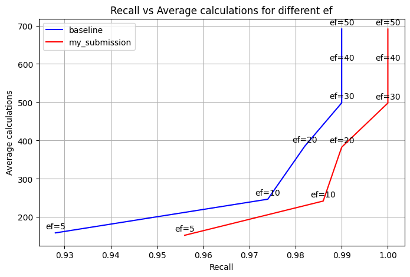
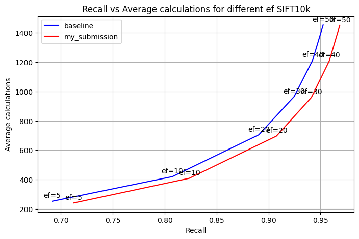

# Navigable Graphs Python
Python based research tool for studying navigable graphs for nearest neighbour search

## Results
### SIFT 10k


### SIFT 1m


Using the SIFT dataset:
```
python navigable-graphs.py --dataset sift
```

Using synthetic data with 3D vectors:
```
python navigable-graphs.py --dataset synthetic --K 20 --k 5 --dim 3 --n 500 --nq 100 --ef 20 --M 2
```
